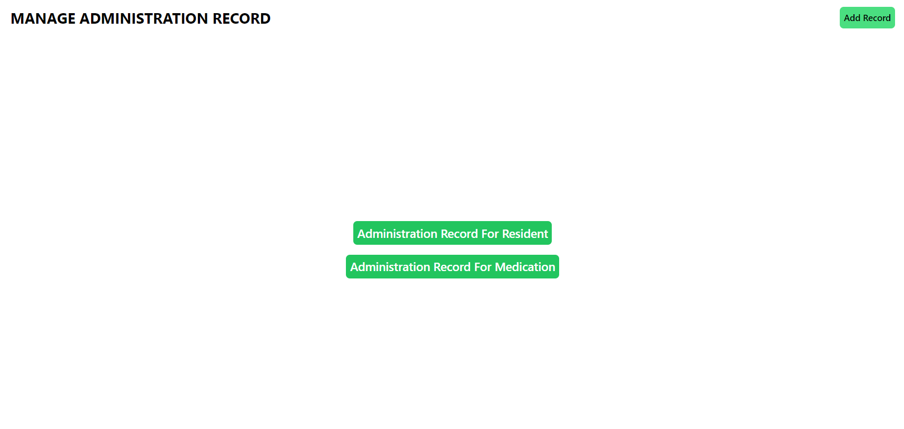

# TrackMyMed: A Basic Medication Administration Application

- **Project for Skill Assessment at Siga Infotech**

TrackMyMed is a basic medication administration application designed to record and view medication administration details. It is built with the MERN Stack and uses TypeScript for the backend.

User authentication is required for every action (adding, updating, or viewing records). The app primarily focuses on JWT token validation for every request the user makes to the server.

## Functionality and API Endpoints

### 1.  Basic Authentication

Once a user has successfully logged in, the server will send a token as a cookie. This token, generated using JWT (jsonwebtoken), will be used to validate all user actions.

- **Endpoints**:
  - `POST /auth/sign-in`
  - `POST /auth/sign-up`

### 2.  Resident Management

An authenticated user can add, update, and view residents.

- **Endpoints**:
  - `POST /resident/add-resident`
  - `PUT /resident/update-resident/:id`
  - `GET /resident/get-resident`

### 3.  Medication Management

An authenticated user can add, update, and view medications.

- **Endpoints**:
  - `POST /medication/add-medication`
  - `PUT /medication/update-medication/:id`
  - `GET /medication/get-medication`

### 4.  Administration Record Management

An authenticated user can add administration records, list all administration records for a specific resident, and list all administration records for a specific medication.

- **Endpoints**:
  - `POST /administration/add-administration-record`
  - `GET /administration/administrations-for-resident/:id`
  - `GET /administration/administrations-for-medication/:id`


## Middlewares

1. **Express-validator**: For validating and sanitizing the data received by the server.
2. **verifyJWT**: Middleware that checks whether the user is authenticated.
3. **Custom error handler**: Middleware that catches and handles custom errors.

## Instructions on how to run

### Backend

1. You should have nodejs and npm installed.

2. Clone the repo, go to backend folder.

3. Install all the dependencies with ```npm i```

4. Create a ```.env``` file in ```/backend``` folder with the following information:

    ```ini
    PORT=4000 // Your desired port where server should listen
    DB_URI="mongodb://localhost:27017/TrackMyMed" // either use the local MongoDB instance or use from atlas

    JWT_KEY="YOURSECRET" // Your JWT Secret
    ```

5. After configuring environment variables, simply run the server by typing ```npm run dev```,
    Now you can test the APIs with any API client tools such as Postman, Insomnia, etc.

## Frontend

1. Go to ```/frontend``` folder and install the dependencies with ```npm i```

2. To run the frontend, simply type ```npm run dev``` or if you want to build
    the frontend for production, then type
    ```
    npm run build
    ```
